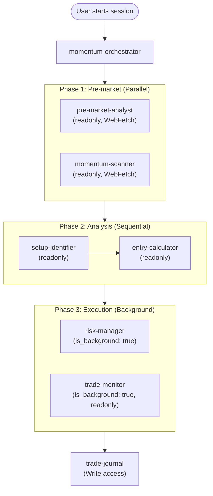

# Momentum Trading Subagents Plan

---
Plan for create subagents for the workflow describes in docs/trading/1.md
---

## Workflow Mapping

Each step in `docs/trading/1.md` becomes a dedicated subagent with single responsibility.



## Agents to Create (`.cursor/agents/`)

**7 specialist agents + 1 orchestrator = 8 total files**

- `pre-market-analyst.md` - Step 1. Reviews economic calendar, earnings, news, pre-market movers. Produces catalyst list. `readonly: true`, model: `sonnet`
- `momentum-scanner.md` - Step 2. Applies scanner filters (price change %, relative volume, float, catalyst). Outputs ranked watchlist (3-10 tickers). `readonly: true`, model: `fast`
- `setup-identifier.md` - Step 3. Identifies Bull Flag, Flat Top Breakout, break-of-high patterns; confirms with volume and tape signals. `readonly: true`, model: `sonnet`
- `entry-calculator.md` - Step 4. Calculates position size from account size, risk %, stop distance. Recommends limit vs. market order. `readonly: true`, model: `fast`
- `risk-manager.md` - Step 5. Sets initial stop-loss, advises when to move to breakeven, generates trailing stop levels. `is_background: false`, model: `fast`
- `trade-monitor.md` - Step 6. Monitors continuation signals and exit triggers (stall, reversal pattern, RSI extreme, volume dry-up). Advises partial vs. full exit. `is_background: true`, `readonly: true`, model: `fast`
- `trade-journal.md` - Step 7. Records trade details (entry/exit, catalyst, P/L, chart notes). Appends to a local journal file. Has Write access, model: `fast`
- `momentum-orchestrator.md` - Top-level coordinator. Runs pre-market analyst + scanner in parallel, then sequences setup -> entry -> risk -> monitor -> journal. model: `sonnet`

## Execution Patterns Used

- **Parallel fan-out**: pre-market-analyst + momentum-scanner run simultaneously at session start
- **Sequential hand-off**: setup-identifier -> entry-calculator (entry depends on confirmed setup)
- **Background**: trade-monitor runs non-blocking while user watches positions
- **Resumable**: trade-monitor persists state to `~/.cursor/subagents/` between checks

## Key Conventions (from `docs/basic/5-subagents.md`)

- No `#` inline comments inside YAML frontmatter
- Descriptions are trigger-phrase-rich (routing logic for auto-delegation)
- System prompts stay 200-400 words; no fluff
- `fast` model for calculators/monitors; `sonnet` for analysis/planning
- Tools locked to minimum needed (`readonly: true` where no writes needed)

## File Locations

All agents land in `.cursor/agents/` (project-scoped):

```
.cursor/agents/
├── momentum-orchestrator.md
├── pre-market-analyst.md
├── momentum-scanner.md
├── setup-identifier.md
├── entry-calculator.md
├── risk-manager.md
├── trade-monitor.md
└── trade-journal.md
```

Journal output file: `.cursor/agents/` references a journal at `docs/trading/journal.md` (created on first run by trade-journal agent).

## Invocation

```
"Use momentum-orchestrator to start my trading session for [date]"
"Ask setup-identifier to analyze NVDA for a bull flag on the 5-min chart"
"Have entry-calculator size a position: $50k account, $0.40 stop, 1% risk"
"Use trade-monitor to watch NVDA long entered at $142.50"
```
