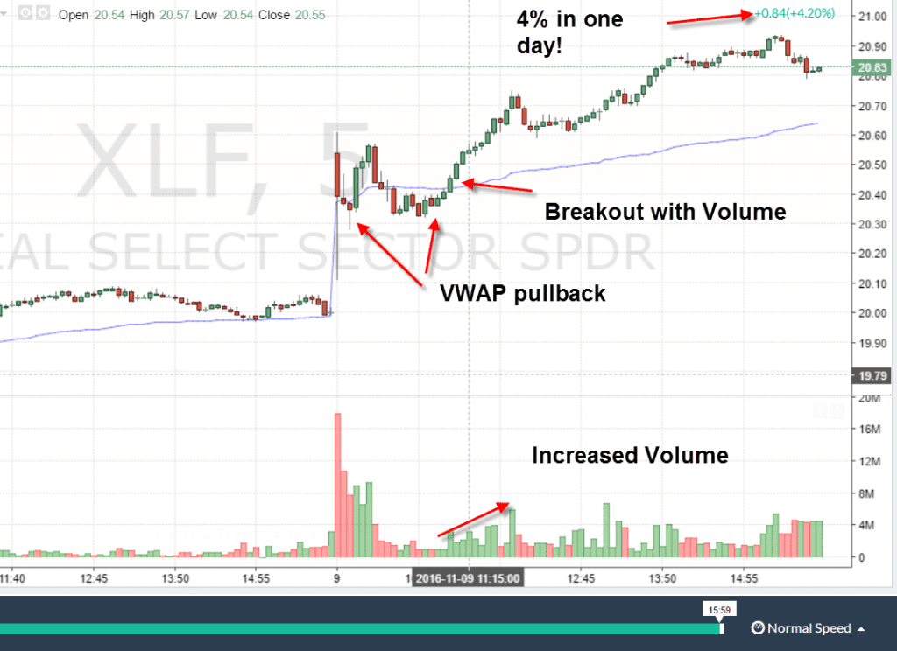
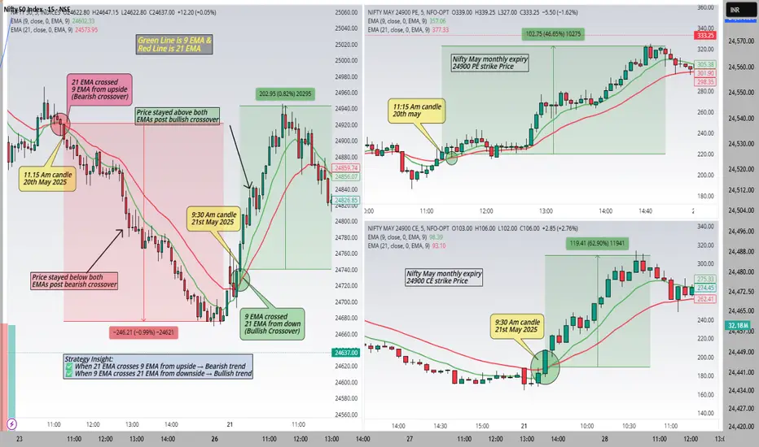
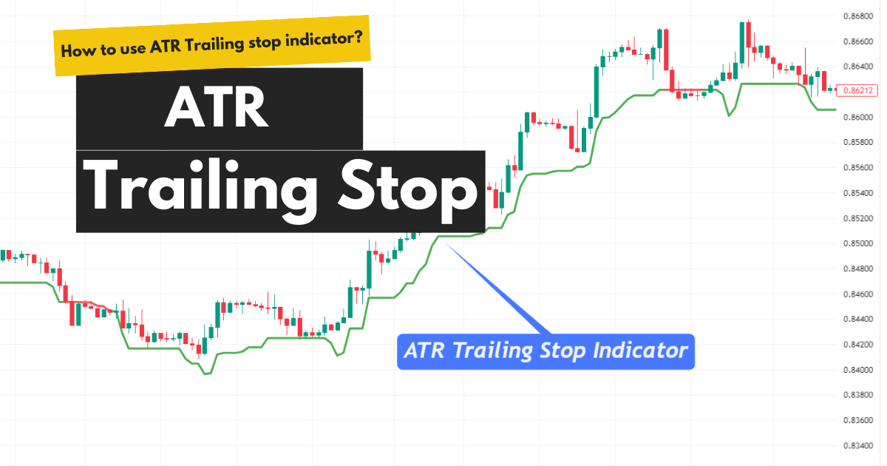

**Reversal or Pullback Trading** (primarily **pullback/continuation** trading) is one of the highest-probability day trading strategies. You wait for a strong directional impulse, then enter during a temporary counter-trend **pullback** to dynamic support (VWAP, 9/20 EMA) or horizontal levels before the trend resumes. This avoids chasing extended moves, gives better entry prices, tighter stops, and superior risk-reward (often 2:1–4:1).

It is **not** a true reversal strategy (which tries to catch trend changes). True reversals are lower probability and require more confirmation. Pullbacks work best in strong trending markets with catalysts.

### Updated Detailed Workflow (Integrated with 1% Rule, ATR Stops & Chandelier Exit)

1. **Preparation (Pre-Market)**  
   - Scan for trending candidates: High relative volume, gappers, clear catalyst (news/earnings), price respecting rising VWAP/EMAs on 5-min chart.  
   - Chart setup: 1-min/5-min + daily context. Add VWAP, 9 EMA, 20 EMA, volume, ATR (14-period).  
   - Pre-define rules: 1% max risk per trade, minimum 2:1 R:R, daily loss limit 2–3%.  
   - Position sizing calculator ready.

   
   Figure 1 - Scan for trending candidates

2. **Identify Trend + Pullback Setup (9:30–11:00 AM ET peak)**  
   - Confirm strong trend: Series of higher highs/lows (longs) with price above rising VWAP/9 EMA.  
   - Spot impulse move (flagpole) on high volume.  
   - Wait for pullback on lighter volume to support:  
     – VWAP (strongest magnet)  
     – 9/20 EMA  
     – Prior swing low or trendline  
   - Healthy pullback: Shallow (≤50–61.8%), low volume, no structure break.

   
   Figure 2 - Identify Trend

3. **Confirmation & Entry**  
   - Wait for resumption signs (never enter mid-pullback):  
     – Bullish candlestick (hammer, engulfing, strong green close) off the level.  
     – Volume increase on the entry candle.  
     – Price holds VWAP/EMA without closing below.  
   - Enter long on confirmation (market or limit).  
   - **1% Rule sizing example**:  
     Entry $50, stop $0.80 away → risk $0.80/share. $50k account (1% = $500) → max 625 shares.

4. **Risk Management – Stop-Loss**  
   - Initial stop: Just below pullback low (or ATR-based for volatility adjustment).  
     – ATR formula: Stop = Entry – (ATR × 1.5–2.0)  
     – Example: ATR = $1.20 → 1.8× = $2.16 stop distance.  
   - This keeps risk tight yet realistic (avoids whipsaws).

   
   Figure 3 - Stop Loss

5. **Trailing & Exit (Let Winners Run)**  
   - After +1R profit: Move stop to breakeven.  
   - Trail with **Chandelier Exit** (best for this strategy):  
     Chandelier (Long) = Highest High (last 10–22 bars) – (ATR × 3)  
     This locks profits while giving room in the trend.  
   - Exit targets: Prior high, measured move, next resistance, or 2:1–4:1 R:R.  
   - Partial scale-out: Sell 50% at first target, trail the rest.  
   - Full exit: Chandelier hit, momentum fade, or end-of-day.

6. **Post-Trade Review**  
   - Journal immediately: Screenshot with levels, ATR value, Chandelier trail, P/L, win/loss reason.  
   - Weekly: Track win rate (aim 55–70%), average R:R, pullback quality.

### Tips for Maximum Effectiveness
- **Confluence wins**: VWAP + EMA bounce + bullish candle + volume = highest edge.  
- **Best conditions**: Strong market trend, first 2 hours, high-volume stocks (AAPL, TSLA, NVDA). Avoid choppy/low-volume days.  
- **Psychology**: Patience during pullback (no chasing). Accept “good losses” when stop hits.  
- **Risk integration**: Always calculate size from ATR/Chandelier stop distance using the 1% rule — never override.

This workflow turns pullbacks into high-probability, low-stress trades with excellent risk-reward. Combine it with the other strategies we covered (momentum for the impulse, breakout for confirmation) and you have a complete day trading system.

Day trading is high-risk — most traders lose money. Practice extensively in a simulator, use only risk capital, and focus on process over profits. If you want me to walk through a live example on a specific stock or run a quick backtest simulation, just say the word!