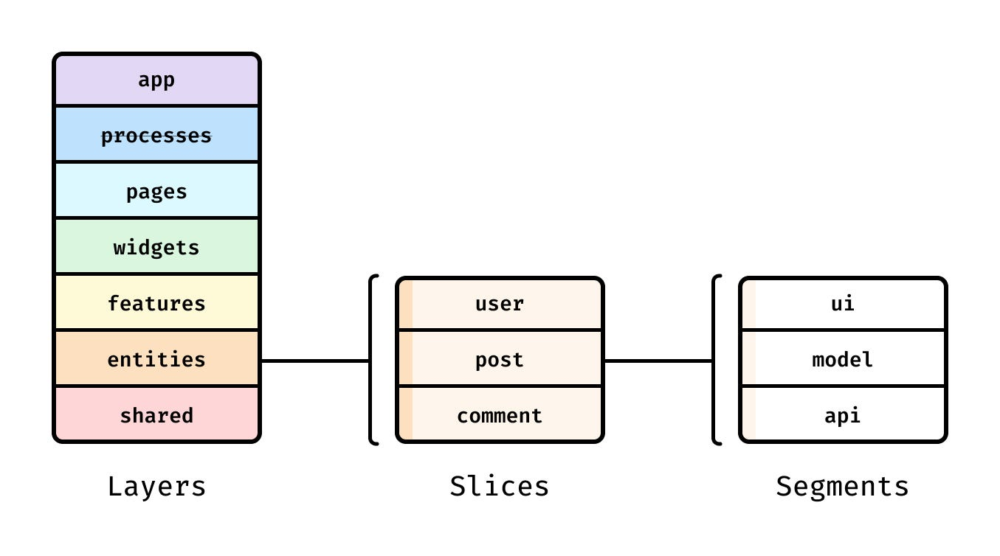
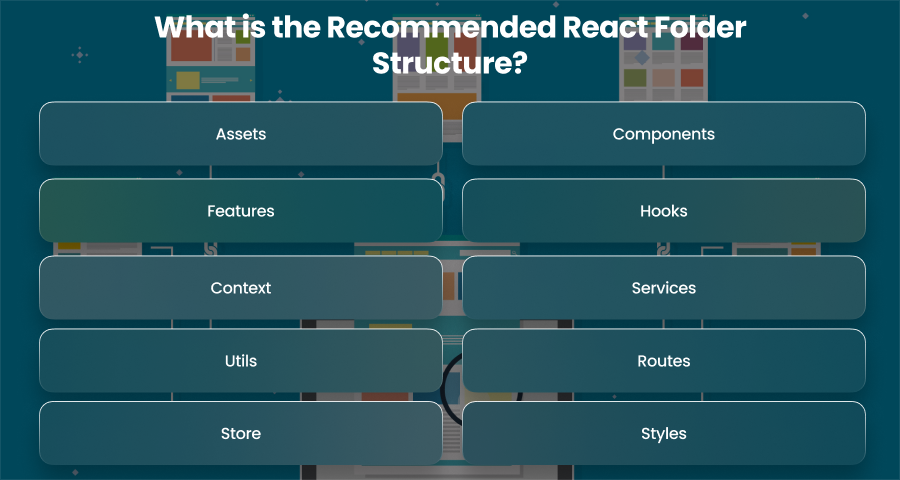
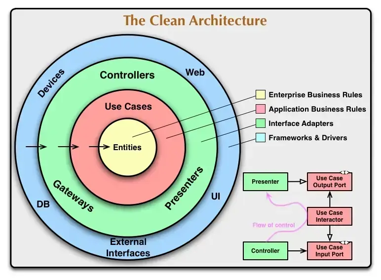

# From React Prototype to Enterprise Production-Grade App

The Bulletproof React production grade app using a **hybrid architecture**:

- **Feature-Sliced Design (FSD)** for business-domain organization and strict layering.
- **Bulletproof React-style feature modules** for practical colocation and scalability.
- **Clean Architecture principles** (Uncle Bob’s concentric layers with dependency rule: inner layers don’t depend on outer) adapted to React via domain models, use-case hooks, and repository abstractions.

This delivers **clean code** (DRY, single-responsibility, meaningful naming), **best practices** (TypeScript, hooks, caching, testing), and **clean architecture** (decoupled, testable, framework-agnostic core).

### Visual Overviews of the Architecture

Here are the core diagrams that guide the structure:



**FSD Layers** (outer = app-level → inner = shared/domain). Slices = business features (e.g., “user-auth”). Segments = ui / model / api / lib. Strict import rules prevent spaghetti.

**Bulletproof React / Feature-Based Practical Structure** (colocated per feature):



**Clean Architecture Layers** (concentric, dependencies point inward):



### Step-by-Step Workflow (Incremental & Safe)

**Phase 1: Audit & Planning (1–3 days)**  
- Map prototype features, identify mixed concerns (logic in components), tech debt, missing tests/security/a11y.  
- Document architecture decision record (ADR): “Why FSD + Clean Arch”.  
- Decide on stack upgrade: Vite + React 19 + strict TypeScript (replace CRA if used).

**Phase 2: Foundation Setup (3–5 days)**  
- Bootstrap or migrate to Vite + TS (strict mode, path aliases `@/`).  
- Install & configure tooling:  
  - ESLint (React/TS/JSX-a11y + no-restricted-paths for layer enforcement) + Prettier + Husky/lint-staged.  
  - Vitest + React Testing Library + MSW (mock server) + Playwright (E2E).  
  - TanStack Query (data fetching/caching), React Router (lazy routes), Zod + React Hook Form, Zustand (client state if needed), Tailwind/shadcn-ui or styled-components.  
  - Storybook for component library.  
- Add public APIs (`index.ts`) and absolute imports everywhere.

**Phase 3: Incremental Architectural Refactor (Core Phase – 1–6 weeks)**  
Migrate **feature-by-feature** (strangler fig pattern – keep old code running until replaced). Never do a big-bang rewrite.

Recommended `src/` structure (Bulletproof + FSD hybrid):

```
src/
├── app/                  # Providers, router, global store setup, ErrorBoundary
├── assets/
├── components/ or shared/ui/   # Reusable primitives (Button, Card)
├── features/             # Main business features (most code lives here)
│   └── auth/
│       ├── api/          # Queries/mutations (TanStack)
│       ├── components/   # Feature-specific UI
│       ├── hooks/ or model/ # Use cases / business logic / Zustand slices
│       ├── types/
│       ├── utils/
│       └── index.ts      # Public API export only
├── entities/             # Domain models (User, Product – pure TS)
├── hooks/                # Shared custom hooks
├── lib/ or shared/       # API client base, utils, config
├── stores/               # Global state (if complex)
├── types/                # Global TS types
└── utils/
```

- **Clean Architecture inside each feature**:  
  - Entities = pure domain models/rules.  
  - Use Cases = custom hooks or model/ segment (orchestrate logic).  
  - Adapters = api/ segment (TanStack Query + interceptors for auth/refresh).  
  - Presentation = ui/components (dumb, receive props/hooks).  
- Enforce rules with ESLint: no upward imports, only public APIs.

**Phase 4: Quality, Clean Code & Best Practices (Parallel to Refactor)**  
- **Conventions**: PascalCase components, camelCase everything else, colocation (test + styles next to component), no barrel files in large features (performance).  
- **Clean Code Practices**: Custom hooks for all logic, presentational components, Zod validation, error boundaries, React.memo / useMemo where measured.  
- **Testing**: 80%+ coverage – unit (hooks/utils), component (RTL), integration (MSW), E2E (Playwright).  
- **Performance**: Lazy routes/components, React Compiler (19), code-splitting, Lighthouse CI.  
- **Accessibility & Others**: axe audits, aria labels, i18n (react-i18next), design tokens.

**Phase 5: Production-Ready Features**  
- Secure auth (TanStack Query interceptors, protected routes).  
- Global error handling, logging (Sentry).  
- Environment variables, build optimizations (Vite).  
- Optional: PWA, offline support.

**Phase 6: CI/CD, Deployment & Monitoring (1 week)**  
- GitHub Actions workflow:  
  - On PR: lint → type-check → test → build.  
  - On main: deploy preview (Vercel/Netlify) or prod.  
  - Cache deps, secrets management.  
- Hosting: Vercel/Netlify (SPA) or AWS S3 + CloudFront.  
- Monitoring: Sentry (errors + performance), bundle analyzer.  
- Optional: Nx/Turborepo if monorepo growth expected.

**Phase 7: Documentation, Processes & Ongoing Maintenance**  
- Storybook as living docs + Chromatic.  
- Architecture diagram + ADRs in repo.  
- Team processes: PR templates, conventional commits, code-owner files, weekly tech-debt review.

### Why This Workflow Succeeds for Enterprise
- **Scalable & Maintainable**: Features are isolated; teams own slices without conflicts.  
- **Clean & Testable**: Domain logic is pure and framework-independent.  
- **Production-Grade**: Built-in testing, CI/CD, monitoring, performance, security, a11y.  
- **Low Risk**: Incremental migration keeps the app shippable at every step.

**Optional Upgrade Note**: If your prototype benefits from SSR/SEO/static generation, evaluate migrating the final app to Next.js 15+ (App Router + React Server Components) – the same FSD architecture ports easily and adds huge enterprise wins.
